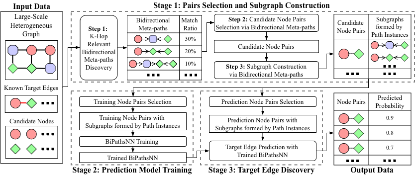
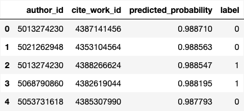
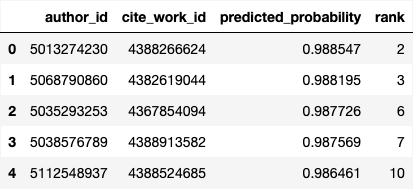

# BiLink

This is the code for the paper **"BiLink: Bidirectional Meta-paths for Link Discovery in Billion-Scale Heterogeneous Graphs"** (under review).

BiLink is a framework for link discovery in billion-scale heterogeneous graphs. It adopts bidirectional meta-path sampling to reduce sampling complexity from $O(d^k)$ to $O(d^{k/2})$ and implements it on distributed systems through uniform table operations. BiLink also includes BiPathsNN, a self-attention based model that jointly encodes the sampling results for link prediction.

# Overview

<p align="center">
  
</p>

As shown in the figure above, BiLink consists of three stages:

1. **Stage 1: Pairs Selection and Subgraph Construction.** Given a large-scale heterogeneous graph with known target edges and candidate nodes, BiLink first discovers relevant bidirectional meta-paths and ranks them by their match ratio against known target edges (**Step 1**). It then selects candidate node pairs using the top-ranked bidirectional meta-paths (**Step 2**), and constructs subgraphs formed by path instances for each candidate pair (**Step 3**).

2. **Stage 2: Prediction Model Training.** Training node pairs are selected from the candidate pairs and labeled using known target edges. BiPathsNN is trained on these labeled pairs and their corresponding subgraphs formed by path instances.

3. **Stage 3: Target Edge Discovery.** The remaining candidate node pairs (without known target edges) are fed into the trained BiPathsNN to predict the probability of target edge existence, discovering the most likely hidden target edges.

# Performance

Here we show results from two link discovery tasks using [OpenAlex](https://openalex.org/), an open academic dataset with over 200 million publications.

### Authors' New References

This task discovers papers that authors will cite for the first time. BiLink selected 1.6 billion candidate author-paper pairs and predicted their probabilities, recalling 31.6% of 2.2M actual new references within the top 1% predictions.

The top 1M predictions ranked by predicted probability are in [new_reference_top_predictions.csv](example_output/new_reference_top_predictions.csv), where `label=1` indicates an actual target edge. All IDs correspond to [OpenAlex](https://openalex.org/) entity IDs and can be accessed directly via `https://openalex.org/authors/A{author_id}` for authors (e.g., [https://openalex.org/authors/A5021083962](https://openalex.org/authors/A5021083962)) and `https://openalex.org/works/W{work_id}` for papers (e.g., [https://openalex.org/works/W4404181019](https://openalex.org/works/W4404181019)).

<p align="center">
  
</p>

The ranks of all 2.2M actual new references among the 1.6 billion candidate pairs are in [new_reference_ground_truth_ranks.csv](example_output/new_reference_ground_truth_ranks.csv):

<p align="center">
  
</p>

### Authors' New Coauthors

This task discovers new collaborations between authors. BiLink selected 1.4 billion candidate author pairs and predicted their probabilities, recalling 34.9% of 1.5M actual new collaborations within the top 1% predictions. The top 1M predictions are in [new_coauthor_top_predictions.csv](example_output/new_coauthor_top_predictions.csv), and the ranks of all 1.5M actual new collaborations are in [new_coauthor_ground_truth_ranks.csv](example_output/new_coauthor_ground_truth_ranks.csv).

# Code Structure
```
BiLink/
│
├── joinminer/               # Core library
│   ├── dataset/             # Dataset handling
│   │   ├── converter/       # Data format conversion
│   │   └── loader/          # Data loading
│   ├── engine/              # Training and inference engine
│   ├── fileio/              # File I/O operations
│   │   └── backends/        # Storage backends
│   ├── graph/               # Graph construction
│   │   ├── element/         # Graph elements (nodes, edges)
│   │   └── join_edges/      # Join edge operations
│   ├── model/               # BiPathsNN model implementation
│   ├── spark/               # Spark operations
│   │   ├── io/              # Spark I/O
│   │   ├── managers/        # Session managers
│   │   ├── operations/      # DataFrame operations
│   │   └── platforms/       # Platform adapters
│   └── utils/               # Utility functions
│
├── main/                    # BiLink framework
│   ├── config/              # Configuration files
│   │   ├── bilink/          # BiLink task configs (per task)
│   │   ├── element/         # Element configs
│   │   ├── graph/           # Graph configs
│   │   └── model/           # Model configs (architecture, hyperparameters)
│   └── link_discovery/      # Task-agnostic link discovery pipeline
│       ├── 1_pairs_selection_and_subgraph_construction/
│       ├── 2_prediction_model_training/
│       └── 3_target_edge_discovery/
│
└── data_prepare/            # Data preparation scripts (per dataset/task)
    └── OpenAlex/
        ├── build_context_tables.py
        ├── build_graph_data.py
        ├── author_new_reference/
        │   └── prepare_task_data.py
        └── author_new_coauthor/
            └── prepare_task_data.py
```

# Requirements

See `environment.yml` for the full list of dependencies. To install:

```bash
conda env create -f environment.yml
conda activate bilink
```

# Usage

## Data Preparation

Download the OpenAlex snapshot from: https://openalex.s3.amazonaws.com/browse.html

Then upload to HDFS:

```bash
hdfs dfs -put openalex-snapshot /user/example/bilink/openalex
```

Build the graph data:

```bash
# Process raw data into table format
python data_prepare/OpenAlex/build_context_tables.py \
    --raw-data-path "hdfs:///user/example/bilink/openalex" \
    --context-table-path "hdfs:///user/example/bilink/openalex/context_table"

# Build heterogeneous graph
python data_prepare/OpenAlex/build_graph_data.py \
    --elements-config main/config/element/openalex_example.yaml \
    --graph-config main/config/graph/openalex_example.yaml \
    --bilink-config main/config/bilink/author_new_reference/21_to_24_example.yaml \
    --target-dates 2021-01-01 2022-01-01 2023-01-01 2024-01-01

# Generate known target edges and candidate nodes (task-specific)
python data_prepare/OpenAlex/author_new_reference/prepare_task_data.py \
    --bilink-config main/config/bilink/author_new_reference/21_to_24_example.yaml \
    --context-table-dir "hdfs:///user/example/bilink/openalex/context_table"
```

## Stage 1: Pairs Selection and Subgraph Construction

Discover relevant bidirectional meta-paths, select candidate node pairs, and construct subgraphs formed by path instances for each candidate pair:

```bash
# Find relevant bidirectional meta-paths
python main/link_discovery/1_pairs_selection_and_subgraph_construction/0_relevant_bipaths_finder.py \
    --bilink-config main/config/bilink/author_new_reference/21_to_24_example.yaml

# Select candidate node pairs based on relevant bidirectional meta-paths
python main/link_discovery/1_pairs_selection_and_subgraph_construction/1_candidate_pairs_selection.py \
    --bilink-config main/config/bilink/author_new_reference/21_to_24_example.yaml

# Prepare sample pairs and construct subgraphs for each candidate pair
python main/link_discovery/1_pairs_selection_and_subgraph_construction/2_sample_pairs_and_subgraph_construction.py \
    --bilink-config main/config/bilink/author_new_reference/21_to_24_example.yaml \
    --mode train \
    --neg-ratios 3 5 7 10
``` 

## Stage 2: Prediction Model Training

Select training node pairs from the candidate pairs and label them using known target edges. Train BiPathsNN on these labeled pairs and their corresponding subgraphs:

```bash
torchrun --nproc_per_node=4 main/link_discovery/2_prediction_model_training/1_bipathsnn.py \
    --bilink-config main/config/bilink/author_new_reference/21_to_24_example.yaml \
    --model-config main/config/model/bipathsnn/default.yaml \
    --train-neg-ratio 10 \
    --eval-neg-ratio 10
```

## Stage 3: Target Edge Discovery

Feed the remaining candidate node pairs into the trained BiPathsNN to predict the probability of target edge existence:

```bash
torchrun --nproc_per_node=2 main/link_discovery/3_target_edge_discovery/bipathsnn.py \
    --bilink-config main/config/bilink/author_new_reference/21_to_24_example.yaml \
    --model-config main/config/model/bipathsnn/default.yaml \
    --checkpoint-name <checkpoint_name> \
    --sample-path <path_to_infer_data> \
    --pred-path <path_to_predictions>
```
